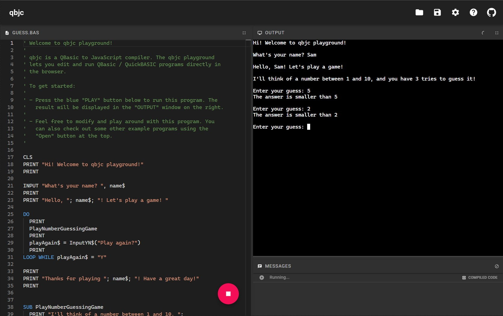

# qbjc

**qbjc** is a QBasic to JavaScript compiler. It can compile a QBasic /
QuickBASIC program to:

- A standalone executable Node.js script, with zero external dependencies; or
- An ES6 module that can be imported and executed in both Node.js and browser environments.

Try it out in the qbjc playground:
[👉 **qbjc.dev** 👈](https://qbjc.dev)

## Usage

### qbjc playground

The qbjc playground
([👉 **qbjc.dev** 👈](https://qbjc.dev))
allows you to edit and run QBasic / QuickBASIC programs directly in the browser,
no installation required.



### Command line usage

```bash
# Install qbjc from NPM
npm install -g qbjc

# Compile hello.bas and write output to hello.bas.js
qbjc hello.bas

# Run the compiled program
./hello.bas.js

# ...or run hello.bas directly:
qbjc --run hello.bas

# See all command line options
qbjc --help
```


### API usage

Compiling a QBasic program:

```TypeScript
import {compile} from 'qbjc';

...
const {
  // Compiled JavaScript code.
  code,
  // Sourcemap for the compiled JavaScript code.
  map,
  // Abstract syntax tree representing the compiled code.
  astModule,
} = await compile({
  // QBasic source code.
  source: 'PRINT "HELLO WORLD"',
  // Optional - Source file name (for debugging information).
  sourceFileName: 'hello.bas',
  // Optional - Whether to bundle with Node.js runtime code in order
  // to produce a standalone script.
  enableBundling: true,
  // Optional - Whether to minify the output.
  enableMinify: false,
});
```

Executing the compiled code:

- In browsers (using [xterm.js](https://xtermjs.org/)):

  ```TypeScript
  import {Terminal} from 'xterm';
  import {BrowserExecutor} from 'qbjc/browser';
  import {compiledModule} from './hello.bas.js';

  // Set up xterm.js Terminal instance
  const terminal = new Terminal(...);

  await new BrowserExecutor(terminal).executeModule(compiledModule);
  ```

- In Node.js:

  ```TypeScript
  import {NodeExecutor} from 'qbjc/node';
  import {compiledModule} from './hello.bas.js';

  await new NodeExecutor().executeModule(compiledModule);
  ```

- In Node.js with bundling enabled (i.e. compiled with `enableBundling: true`):
  ```TypeScript
  import {run} from './hello.bas.js';
  await run();
  ```

## Compatibility

For detailed compatibility information on individual commands and functions, see
[👉 Implementation Status](https://airtable.com/shrITVmjepv00kwpT).

### What works:

- Core language features

  - Control flow structures - loops, conditionals, `GOTO`, `GOSUB` etc.
  - Data types - primitive types, arrays and user-defined types (a.k.a. records)
  - Expressions - arithmetic, string, comparison, boolean
  - `SUB`s and `FUNCTION`s
  - `DATA` constants
  - Many built-in commands and functions like `VAL`, `STR$`, `INSTR`, `MID$`

- Text mode

  - Basic text mode I/O - `PRINT`, `INPUT`, `INKEY$`, `INPUT$` etc.
  - Text mode screen manipulation - `COLOR`, `LOCATE` etc.
  - Note that the current implementation depends on a VT100-compatible terminal emulator.
    - On Windows, this means using WSL or something like PuTTY.
    - In the browser, the implementation uses [xterm.js](https://xtermjs.org/).

- It's just enough to run the original [`NIBBLES.BAS` game](./qbjc-playground/examples/nibbles.bas) that shipped with QBasic:
  

### What doesn't work (yet):

- Graphics and audio
- Events - `ON ERROR`, `ON TIMER` etc.
- OS APIs like file I/O, `CALL INTERRUPT` etc.
- Direct memory access - `PEEK`, `POKE` etc.
- Less common syntax, inputs or options
- ...and more - contributions are welcome!

## About

qbjc is distributed under the Apache License v2.
